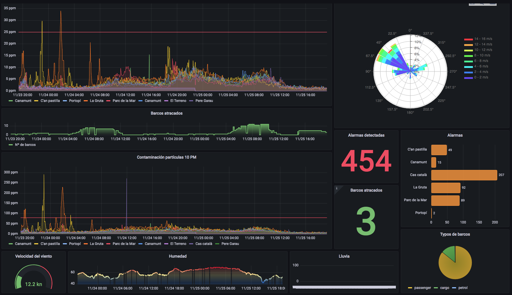
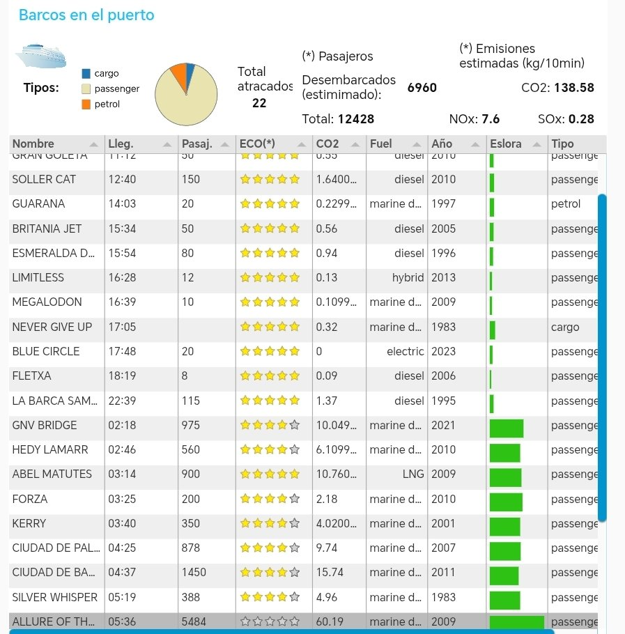
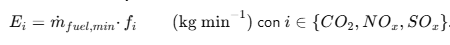

#  Fum al Port

**La calidad del aire que respiramos tiene un impacto directo en nuestra salud**. No respirar un aire limpio causa una variedad de problemas de salud, incluidas infecciones respiratorias, dolores de cabeza y fatiga. También puede agravar condiciones existentes como el asma y las alergias.

Los focos de contaminación varían a lo largo de la historia de una ciudad, y pueden localizarse por ejemplo en industria, tráfico rodado o tráfico marítimo. Este último es el caso de estudio de este proyecto, ya que puede suponer un impacto significativo en la calidad del aire. 


El monitoreo ambiental en ciudades se refiere a las prácticas de seguridad y privacidad utilizadas para proteger a los ciudadanos de los contaminantes transportados por el aire. Esto incluye la recopilación de datos sobre la calidad del aire, la temperatura, la humedad y otros factores ambientales. Estos datos luego se utilizan para evaluar el riesgo de exposición a materiales peligrosos y tomar medidas para mitigar o eliminar esos riesgos.

## Objetivos
Principalmente, crear una plataforma abierta de monitorización del puerto de Palma de Mallorca para registrar su actividad y generar alertas sobre riesgos ambientales y su impacto urbano en tiempo real.

- Monitorización en tiempo real del tráfico marítimo y su impacto ambiental
- Emitir alertas para informar a la ciudania de riesgos y problemas
- Tratar de identificar los focos de la contaminación.
- Hacer un análisis predictivo para dar avisos de contaminación.

## Nuestra solución


 Para abordar este desafío, se desarrolló un proyecto de ciencia ciudadana con el apoyo de la [AVV Canamunt](https://es-la.facebook.com/avvcanamunt/). Que parte de [talleres de fabricación de sensores de calidad de aire](https://www.meetup.com/makespace-mallorca/events/282643149?utm_medium=referral&utm_campaign=share-btn_savedevents_share_modal&utm_source=link) realizados en el Fablab de Mallorca y que son posteriormente desplegados y construidos por los ciudadanos. Esto forma una red de monitoreo ambiental basado en [sensores SDS011](http://www.aliexpress.com/wholesale?groupsort=1&SortType=price_asc&SearchText=sds011) que monitorean el ambiente exterior y envían los datos recopilados a una solución en la nube donde se pueden realizar más cálculos. Con el fin de:

- **Emitir alertas** para informar a la ciudania de riesgos a la salud en tiempo real.
- Hacer un **análisis predictivo** para dar avisos de contaminación con antelación.
- Tratar de **identificar los focos** de la contaminación.

En un primer enfoque, **la solución gira en torno a la actividad en el puerto de Palma de Mallorca**. De manera que se está recopilando y tratando solo la información de este entorno. Detrás de esta iniciativa está el proyecto de la plataforma abierta [Sensor Community](https://sensor.community/es/) de [Open Data Stuttgart](https://github.com/opendata-stuttgart/) que soporta parte de la infraestructura.

## Arquitectura de solución
Este proyecto cumple con modelos y estándares utilizados en soluciones de **Smart City**. Y se ha diseñado una arquitectura basada en uno de los más utilizados *stacks* de IoT: MQTT, Node-RED, InfluxDB y Grafana. Todo está desplegado sobre infraestructura Raspberry Pi y corriendo en contenedores Docker.


### Sensores 


Se ha partido de los [sensores Airroh](https://github.com/McOrts/taller-iot-sensor_calidad_aire) medioambientales. Aunque solo utilizamos la lectura de partículas en suspensión. Estos dispositivos también leen temperatura, humedad y presión atmosférica. Pero dentro de este proyecto, estamos diseñando unos más simples para la detección de partículas de 2,5 nm que son el principal indicador de calidad de aire.

La conectividad se resuelve utilizando una WiFi a su alcance para transmitir las lecturas por UDP tanto a los servidores de Sensor Community como a los de Fum Al Port. 

Por otra parte tenemos información meteorológica de una estación situada en el centro del puerto y la posibilidad de utilizar otras micro-estaciones autónomas y conectadas por LoRaWAN.

### Backend 

Una aplicacion Node-RED recoge todos los datos a través de conexiones UDP, llamadas a APIs y colas MQTT. Tanto esta información de observaciones como la predictiva se almacena en una base de basada en series temporales muy utilizada en IoT que es InfluxDB. 

Node-RED además orquesta las llamadas a otros módulos:
- Python para captura de datos de webs.
- Pandas para la analítica de datos.
- Bots de Telegram y Twitter.

### Aplicación de usuario


Se ha desarrollado una aplicación web a fin de disponer de un Lugar donde a la vez que se informa del proyecto. Se muestran todos loa datos recopilados junto con los índices más importantes calculados por los algoritmos.  
Esa aplicación web es accesible desde: [www.fumport.de-a.org](http://fumport.de-a.org/ui) y consta de los siguientes módulos:
<br>
<br>

#### Información actualizada 


Esta página recopila todos los indicadores de observación y predicción. Además del mapa de sensores y el enlace para el escritorio avanzado de gráficos y estadísticas.

#### Formulario de participación 

Cabe la posibilidad de subscribirse a las alarmas y avisos emitidos por Twitter, Telegram y mail-list. Para ello se puede acceder por la opción de **Participación** desde el menú de hamburguesa. 


La persona interesada solo tiene que seleccionar el barrio donde reside o del que le interesa saber cuándo se ha detectado contaminación o si hay avisos de que vaya a haberla. En los siguientes campos se indica un nombre o alias y sus usuarios de los canales por lo que quiera ser informado.

También se ha reservado una casilla para indicar si se está interesado en instalar un sensor de calidad del aire. Si se marca, nos pondremos en contacto para ayudarle en esta tarea.

## Análisis de datos
### Primera fase
Se ha puesto especial interés en una buena visualización de datos. Para ello hay desplegada una instancia de Grafana que lee la información directamente de InfluxDB. 



La visualización de los datos es necesaria tanto para detectar errores, caídas de servicio o valores inusuales como para diseñar la analítica de datos que se puede hacer partiendo de correlaciones que aparecen. En nuestro caso sería la presencia de barcos y la detección de contaminantes.

Inicialmente se ha desarrollado una analítica básica de un algoritmo de avisos de riesgo propagación de contaminación. Es una cascada de condiciones *and*:

> + Si no está lloviendo
>   + Y el viento lleva soplando en la misma dirección más de 10 minutos
>     + Y la velocidad del viento es mayor de 5 nudos.
>       + Y la dirección coincide con un arco de propagación hacia el sensor.
 


#### Impacto, saturación y capacidad del puerto (*)
la actividad del puerto se analiza cada 10 minutos quedando reflejada en una tabla y varios indicadores. Esta información se puede ver en el apartado de **Barcos en el puerto** de la página principal de la web.


- **Indice de impacto**. Basándose en otros índices como el EEXI o YETI. Se han utilizado datos públicos de las especificaciones de los barcos que transitan por el puerto, para calcular un índice en función de todos los parámetros que afectan al medio ambiente:
   * Contaminación directa por el combustible utilizado en el entorno portuario. Siendo el fuel marino el de mayor consideración y el consumo eléctrico el de menos.
   * Impacto en el entorno ciudadano basado en la capacidad de pasaje y la envergadura de la embarcación (registro bruto).
Se ha definido una fórmula de cálculo para que este índice tenga una escala de 5 valores. De mayor a menor impacto. Los valores son ponderados para cada embarcación en base al máximo de todos los calculados.


<br>


- **Indice de saturación portuaria**. Dado que la capacidad de amarre de un puerto está limitada al número de alineaciones y estas suman un total de metros. Con la suma de las esloras de los barcos atracados se puede hacer una aproximación a lo cerca que se está de esta capacidad total. O sea de la saturación de barcos amarrados. Como valor total para el Puerto de Palma se ha obtenido la cifra de 5.198,8 metros según figura en el apartado 2.2.1.1 de la [Memoria Anual de 2021](./doc/MemoriaAnual2021Digital_0.pdf) para uso de ferris, Ro-Ro y mercancias.

- **Capacidad actual de pasajeros**. Es la suma de las capacidades máximas de pasajeros en doble ocupación declaradas por las embarcaciones. Evidentemente la cifra real siempre será inferior. Para estimar el desembarque de passageros, se considera un 80% de ocupación media de la cifra anterior y sobre el resultado, se aplica un 70% que es el porcentaje más bajo del rango estadístico.



El set de datos utilizado para aplicar la lógica descrita anteriormente forma parte de este repositorio. Es un .json con el nombre [vessels_info.json](https://github.com/McOrts/fumport/blob/main/DDL/vessels_info.json)

Esta colección de datos persiste en la base de datos InfluxDB que alimenta la aplicación. El índice de impacto está precalculado con la lógica descrita en el documento de hoja de cálculo de LibreOffice [vessels_polution_impact_calculation.ods](https://github.com/McOrts/fumport/blob/main/DDL/vessels_polution_impact_calculation.ods) quedando registrado en la propiedad "port_emission_score" del vessels_info.json.

#### Supervición del acuerdo de limitación 
El 4 de mayo de 2022, la patronal de las navieras CLIA y las principales empresas del sector de cruceros, entre ellas TUI Cruise, Royal Caribbean, MSC, Costa y Virgin, firmaron en el Palacio de Congresos el memorándum de entendimiento con el Govern para limitar la llegada de escalas de cruceros en el puerto de Palma de Mallorca hasta 2026.
Dicho acuerdo se resume en estas restricciones:
- Solo podrán coincidir tres cruceros al día. Se considera crucero a un navio de más de 500
camas bajas de capacidad.
- Solo uno de ellos podrá ser un megacrucero con más de 5.000 pasajeros.
- Además hay un límite diario de 8.500 cruceristas en cómputo semanal en Palma

### Estimaciones de emisiones de gases contaminantes
Con el fin de concretar la estimación del impacto medioambiental. El cálculo de las emisiones de gases contaminantes es un elemento clave. Se ha intentando aplicar una metodología rigurosa en el **calculao cada 10 minutos de las las emisiones instantáneas de CO₂, NOₓ y SOₓ que son producidas por buques atracados en el puerto cuyo consumo no corresponde con el usado en el desplazamiento sino para los servicios a bordo**. Se cubren tres familias de combustible (gasóleo marino, fuel pesado y gas natural licuado) y dos tipologías operativas (pasajeros y petroleros/cargo). A continuación se describen los fundamentos físico‑químicos, las fórmulas empíricas empleadas y su implementación en un flujo **Node‑RED**. Además, contextualiza el estado actual del servicio **Cold Ironing** local, destacando exclusiones (p. ej. *ELEANOR ROOSEVELT*).


#### 1. Introducción
La directiva 2008/50/CE y el **Real Decreto 102/2011** obligan a los puertos españoles a monitorizar contaminantes atmosféricos. El Govern de les Illes Balears publica inventarios donde la navegación aporta >20 % de NOₓ regional (CAIB, 2024). Palma ha iniciado el despliegue OPS (*On‑shore Power Supply*) pero, salvo dos atraques en Paraires, la mayoría de escalas mantienen motores auxiliares encendidos (Mrabet, 2022).

#### 2. Parámetros considerados y su fundamento
| Variable | Símbolo | Fundamentación técnica |
|-------------------------|---------|------------------------|
| `engine_power` (kW)            | P<sub>inst</sub> | Limita la potencia eléctrica disponible. Norma ISO 3046. |
| `passengers`                   | N<sub>pax</sub> | La demanda hotel (HVAC, cocina, ascensores) escala ~2 kW/pax (CE Delft, 2021). |
| `year_built`                   | `year` | Mejora del rendimiento mecánico ≈ 0,2 %/año (IMO EEDI). |
| `type` (`passenger`/`petrol`)  | — | Define el algoritmo de hotel load (sección 3.2). |
| `fuel_type`                    | — | Selecciona SFC y fracciones másicas. |

##### 2.1 Supuesto de Potencia de Hotel
"Hotel Load" (P<sub>h</sub>) es la energía eléctrica que un barco necesita mientras está amarrado para mantener todos los servicios a bordo que hacen cómoda la vida de las personas y el funcionamiento básico del buque, aun cuando los motores de propulsión están apagados. Incluye, por ejemplo:
* Iluminación de camarotes, pasillos y zonas comunes.
* Aire acondicionado o calefacción.
* Cocinas, frigoríficos y lavanderías.
* Bombas de agua, ascensores y sistemas informáticos.
* Equipos de seguridad y comunicación.

En otras palabras, es la «corriente para la casa» del barco: todo lo que sigue funcionando para que la tripulación y los pasajeros dispongan de luz, climatización y servicios esenciales, igual que en un hotel en tierra.
* **Pasajeros:**  
  P<sub>h</sub> = min(P<sub>inst</sub> , N<sub>ipax</sub> * 2 kW})
* **Petrolero / Cargo:**  
  P<sub>h</sub> = 0,05 * P<sub>inst</sub>
  (media extraída de MR‑tankers 50 k dwt ≈ 500 kW frente a 10 MW — *MAN ES Case Study*, 2023).

##### 2.2 Consumo Específico de Combustible (SFC)
| Combustible | SFC (kg·kWh⁻¹) | Fuente |
|-------------|----------------|--------|
| Diesel / Marine Diesel | 0.22 | MAN 4‑stroke L32/44CR datasheet 2024 |
| Heavy Fuel Oil (HFO)   | 0.24 | IMO GHG Study 2020 |
| LNG (gas‑dual)         | 0.19 | Wärtsilä 34DF TechNote 2023 |

#### 3. Metodología de Cálculo
##### 3.1 Eficiencia y Factor de Corrección (CF)
Los motores más nuevos son más eficientes. Si tomamos como rendimiento de referencia η₀ = 40 % para buques recientes (año 2025) y suponemos que en el año 2000 su eficiencia caía hasta η₍₂₀₀₀₎ = 35 %, podemos interpolar:


Interpretación: CF > 1 penaliza buques antiguos por mayor consumo real.

##### 3.2 Flujo de masa de combustible


##### 3.3 Fracciones másicas de gases de escape
| Gas | Diesel & MD | Heavy Fuel Oil (HFO) | LNG | Referencia |
|-----|-------------|-----|-----|------------|
| N₂      | 77.62 % | ≈ 78 % | 84.92 % | Wärtsilä 2023 |
| CO₂     | 13.77 % | 13.77 % | 15.00 % | ibid. |
| NOₓ     | 0.20 % | 0.20 % | 0.08 % | MARPOL VI |
| SOₓ     | 0.03 % | **5.0 %** (S = 2.5 %) | 0 % | ISO 8217 |

##### 3.4 Emisiones por minuto
Para estimar las emisiones de cada gas por minuto en régimen de hotel (sólo “hotel load”), podemos usar la siguiente fórmula:


Como ejemplo se muestra el cálculo de las emisiones por minuto en puerto (solo “hotel load”) para un motor que queme gas natural GNL (LNG), tomando como ejemplo un motor de 1.000 kW y aplicando el mismo factor de corrección de averías/eficiencia (CF = 1,081) y SFC típico para GNL de 0,17 kg/kWh:
1. Cálculo de la masa de GNL


2. Aplicando las proporciones típicas de los principales gases en el escape de un motor LNG descritas en el punto 3.3 Estas serían las emisiones por minuto:


#### 4. Implementación Node‑RED
##### 4.1 Estructura del flujo


#### 5. Cold Ironing en Palma
El proyecto **OPS Palma – Muelle Paraires** entró en servicio en 2023 (APB, 2024). Actualmente conecta únicamente:
* *ELEANOR ROOSEVELT* (fast‑ferry de Balearia)
* Un ferry Ro‑Pax clase Visentini  

Los buques con OPS no se incluyen en el cálculo porque apagan motores auxiliares durante la conexión.

#### 6. Ejemplo comparativo
| Parámetro | Ferry 2010 (MD) | Petrolero 2015 (HFO) | Ferry LNG 2022 |
|-----------|-----------------|----------------------|----------------|
| P<sub>inst</sub> (kW) | 15 000 | 11 000 | 16 500 |
| P<sub>h</sub> (kW) | 1 600 | 550 | 1 800 |
| CF | 1.081 | 1.048 | 1.000 |
| SFC (kg/kWh) | 0.22 | 0.24 | 0.19 |
| Fuel kg/min | 0.636 | 0.231 | 0.571 |
| CO₂ kg/min  | **0.088** | 0.032 | 0.086 |
| NOₓ kg/min  | 0.0013 | 0.00046 | 0.00046 |
| SOₓ kg/min  | 0.00019 | **0.012** | 0.00000 |

El cálculo completo para el caso de un barco de un crucero del año 2010 con capacidad de 500 pasajeros y combustible de fuel pesado sería:
<br>


#### 7. Conclusiones pedagógicas
1. **Hotel load** se relaciona con el servicio (pax) o el tipo de buque (5 % en petroleros).  
2. El ajuste de **eficiencia** por antigüedad evita sub‑/sobrestimar consumos.  
3. SFC y fracciones másicas deben actualizarse según fichas de motor e ISO 8217.  
4. OPS ya reduce emisiones de algunos atraques; el flujo los excluye.

#### 8. Bibliografía
1. IMO. *MARPOL Annex VI* (2023 ed.).  
2. EMEP/EEA. *Guidebook 2019 – 1.A.3.d Navigation* (Update 2021).  
3. Mrabet, A. *TFG: Cold Ironing en el puerto de Palma* (UPC, 2022).  
4. Autoritat Portuària de Balears. *Memoria Anual 2023* (2024).  
5. Wärtsilä. *TechNotes – Gas & DF Engines* (2023).  
6. CE Delft. *Energy use of cruise ships in port* (2021).  
7. MAN ES. *Project Guide L32/44CR* (2024).  


### Segunda fase
Análisis de las curvas de detección y propagación para distinguir entre:
- Contaminación aislada: posiblemente de origen próximo al sensor. Humo de barbacoa, contaminación de tráfico rodado. 
- Nube de contaminante propagándose por la ciudad: originado por un foco importante de contaminación.


Nuestro objetivo final es implementar un algoritmo que, en base a una red de sensores suficientemente densa y la correlación de los factores de atraques, meteorología y contaminación, pueda identificar con un grado de certidumbre aceptable, el origen de la contaminación.

## Operación
### Avisos y alertas automáticos
La solución incluye dos bots que son controlados automáticamente por Node-RED en respuesta a la salida de los diferentes algoritmos de observación y predicción.


Tanto la cuenta de Twitter como el canal de Telegram son públicos y cualquier persona puede subscribirse.

Por otra parte, existe la cuenta de Gmail: fumport@gmail.com que es sobre la que se hace el envío de mail-list a los usuarios inscritos.

### Control desde Telegram


Dado que el sistema tiene una interacción con usuarios. Se ha configurado el Bot de Telegram para que atienda a ciertos comandos a fin de poder operar el funcionamiento de las aplicaciones de una forma remota y rápida. 
Este es el set actual de comandos:
```
/stop - Bloquea todas las notificaciones. 
/start - Activa todas las notificaciones. 
/users - Listado de usuarios registrados. 
/vessels - Registrar número de barcos en el puerto.
```
En un futuro los usuarios podrán enviar peticiones por este medio a la aplicación.

## Acceso libre a los datos

De forma **on-line y en tiempo real**. Tanto los datos de la operación del puerto como de emisiones estimadas y la meteorología. Se puede recibir por subscripción a libre y gratuita a un servicio público de broker MQTT. Los parámetros de conexión son:
- URL: mqtt.iot-foundations.org
- Puerto: 1883
- MQTT Topic: sensograma/PMI/port_espmi
- Usuario: user_r
- Clave: Ecology6-Cassette4-Roving3

También hay una carpeta con un volcado de todas las entidades de datos almacenadas en InfluxDB a excepción de la de usuarios, en este mismo repositorio: https://github.com/McOrts/fumport/tree/main/DDL

Las entidades de datos utilizadas son:
- (sensors_readings.json) Lecturas sensores de calidad del aire
- (sensors.json) Inventario de sensores
- (vessels_location.json) Localización de los barcos
- (weathers_readings.json) Lecturas estación metereológica

Por otra parte la plataforma Sensor Community ofrece un REST API que permite tanto la consulta como la ingesta de datos. Más información en: https://github.com/opendata-stuttgart/meta/wiki/EN-APIs y en el swagger no oficial que está un poco desactualizado: https://api-sensor-community.bessarabov.com/#/data/get_airrohr_v1_sensor__SensorID__

Finalmente hay un archivo con el volcado de todas las lecturas a nivel mundial por día: https://archive.sensor.community/

## Agradecimientos 
- [Arcadio Barbas](https://x.com/tribologyst) Jefe de máquinas de Marina Mercante retirado y experto en contaminación marina. Por compartir su extenso conocimiento y por su apoyo incondicional.
- Guillermo M. [@Guillermo-rn](https://github.com/Guillermo-rn) por su magia con el Data Mining que es la guinda del proyecto.
- Martí [@Gonellarro](https://github.com/Gonellarro) por su incansable búsquera y captura de información de la posición de los barcos.
- [Associació de Veïnes de Canamunt](https://es-la.facebook.com/avvcanamunt/)
- [Sensor.Community](https://sensor.community/)

> Y gracias a todos los que **participan en construir y desplegar sensores** dando a conocer datos ambientales y ayudado a que los que pueden hacer de nuestra ciudad un lugar mejor para vivir.

